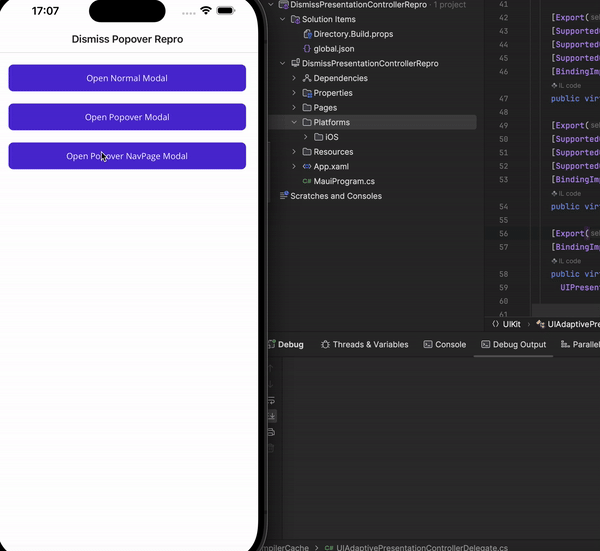

# Dismiss Presentation Controller Repro

This repro contains a reproduction of a maui issue where the `UIAdaptivePresentationControllerDelegate` does not work.

When using the `ModalPresentationStyle` in iOS, the page can be swiped closed by the user and there is no XF / Maui callback to handle this event. This issue was [identified and fixed in MVVM Cross](https://github.com/MvvmCross/MvvmCross/issues/3546) (XF) where their viewmodels werent closed, I have experienced the same issue with Prism (how I discovered the issue) and investigated the issue. It turns out Prism is unable to detect closed pages presented in this style and as a result causes issues with which page is active.

I have created a swift reproduction of the code & behavior I'd expect to see. It works as expected, when I swipe the popover pages away, the delegate fires and I have an event to handle:

For the maui approach I have tried 2 ways of setting the delegate:

### 1 - Navigation Renderer

Using a navigation renderer, I try and set the delegate in [`ViewDidLoad`](https://github.com/Axemasta/DismissPresentationControllerRepro/blob/819ed2e5639167e328cfb70a98125198503eccdb/Maui/DismissPresentationControllerRepro/Platforms/iOS/Handlers/DismissAwareNavigationPageHandler.cs#L16), the code executes but the callback never invokes

### 2 - Page Renderer

Wondering if accessing the navigation page was an issue, since in the swift code I set these details on the `UIViewController`, I used a custom content page renderer (setting a custom `UIViewController` from [this recommendation](https://github.com/dotnet/maui/issues/7174#issuecomment-1505519377)). I tried setting the delegate on the `UIViewController` `PresentationController` and using the parent NavigationController but the delegate once again does not fire.

For both examples you can see the debug statements that my code is executed and the delegates are set, but nothing actually seems to happen which is frustrating since these pages cause our apps to break catastriphically.

Here is the sample app running, you can see the debug statements from when the delegate gets set, but the dismiss action does not fire.

